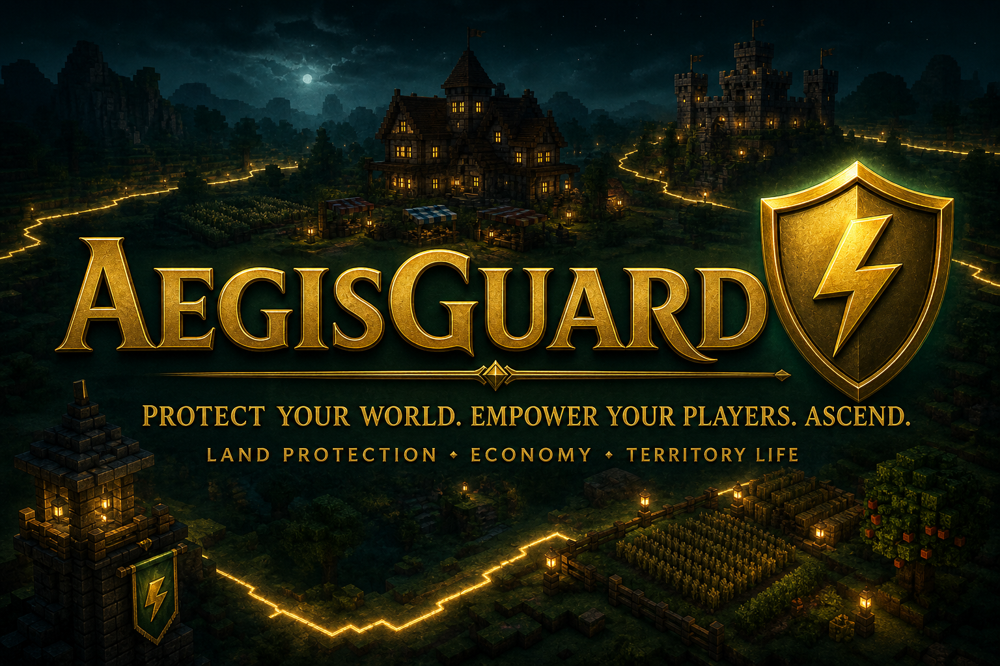

<p align="center">
  
</p>

<h1 align="center">AegisGuard 1.3.5</h1>

<p align="center">
  <strong>Protect your world. Empower your players. Ascend.</strong>
</p>

<p align="center">
  
  
  
  
  <a href="https://discord.gg/nHwdhKzeKR"></a>
  <a href="https://github.com/snazzyatoms/AegisGuard"></a>
</p>

<p align="center">
  <a href="https://github.com/snazzyatoms/AegisGuard/wiki">Wiki</a> &bull;
  <a href="https://discord.gg/nHwdhKzeKR">Discord</a> &bull;
  <a href="https://github.com/snazzyatoms/AegisGuard/issues">Issues</a> &bull;
  <a href="https://github.com/snazzyatoms/AegisGuard/releases">Releases</a>
</p>

---

## A Living Territory System

**AegisGuard** is a Minecraft land-protection plugin that turns claims into a full territory experience. Players secure land, develop plots, manage roles and rentals, run local markets, discover destinations, and pursue long-term progression. Staff get recovery snapshots, migration tools, diagnostics, world controls, and an audit trail for high-impact actions.

It runs on **Paper, Purpur, Spigot, and Folia** with **Java 21+**. **1.3.5** is the current public release. Existing `1.2.7` and `1.3.0` data and configuration remain valid through automatic schema migration.

> Release notes are in [`RELEASE_NOTES_1.3.5.md`](RELEASE_NOTES_1.3.5.md). Wiki sources live in [`wiki/`](wiki/). Server and API JARs are attached to the [1.3.5 GitHub Release](https://github.com/snazzyatoms/AegisGuard/releases/tag/1.3.5).

## What Is New In 1.3.5

**Teleport Beacons** let players place linked pads on claims they manage. Stand next to a pad, confirm, and land only at the linked pad. Visit, market, and auction travel can require a public arrival beacon when the module is on. Server owners choose the fee policy in `teleport_beacons.charges`: mixed free and paid pads (`owner_choice`), a server-wide fee (`always`), or no charges (`off`). Optional maintenance fees can pay the plot owner. `/ag home` stays personal plot spawn.

Language `{KEY}` placeholders now fill in on strings loaded from `lang/`, not only English fallbacks. Expanding land no longer drives ClaimBlocks negative; extra area is refused if the wallet cannot cover it. `claims.min_radius` is enforced on **both** axes (default `5` is at least a 10×10 plot). Group claims check the leader's ClaimBlocks. Chest GUIs stay Java-normal for Java clients. With Geyser/Floodgate, Bedrock players are detected automatically (`gui.bedrock.detect`, default on) and use left-click plus sneak-left instead of right-click.

Staff recovery snapshots now restore complete versioned plot state, including access, market, progression, social, zone, stall, spawn, cosmetic, and travel settings. Optional **full plot backups** copy the complete claim volume through WorldEdit or FastAsyncWorldEdit, with atomic manifests, SHA-256 integrity checks, exact coverage validation, one-chunk Folia ownership tasks, durable per-tile restart progress, protected rescue snapshots, and fail-closed compatibility checks. Configurable automatic backups cover player plots and server zones in bounded Folia-safe batches, skip unchanged plot data, pause under load, and enforce retention. Automatic data and build backups are both **off** by default; Folia build backups require FAWE by default.

## Upcoming in 1.4.0

The next release is still in development and is **not part of 1.3.5**. The features below are **planned and not yet released**; they are previewed here so server owners can plan ahead. Nothing in this section ships in the current 1.3.5 build.

**Travel Atlas arrival choice.** Each plot will offer a player and owner choice between classic plot-spawn travel and beacon-pad arrival, with a traveler override available where the owner permits it. A new `/ag arrival <classic|beacon>` control will let players pick how they land.

**Beacon hardening.** Teleport beacons will enforce one beacon per block and strict one-to-one A→B links, so a pad cannot hold duplicate connections. Stray or orphaned pads will be de-duplicated automatically.

**Arrival flow polish.** A configurable stand-to-confirm delay, a soft arrival sparkle, and a create cooldown are planned to make travel feel deliberate and prevent accidental or rapid pad creation.

**Schema.** 1.4.0 will ship with its own config schema bump; the current 1.3.5 schema is unchanged by this preview.

## What Is New In 1.3.0

### Language Picker

Settings no longer cycles language packs one click at a time. Open language from Settings to reach **Choose Your Language**, which lists every installed pack. All nine packs — Modern English, Old English, Mexican Spanish, Argentinian Spanish, Brazilian Portuguese, French, Italian, German, and Polish — plus Codex fallbacks stay in sync, so switching languages does not fall back to English placeholders.

### Server-Zone Stewardship

Wand-create and convert-to-server share one stewardship pipeline. Converting a plot wipes old access, grants **Steward** to the acting staffer, and can open Claim Settings when configured. Managing a server zone is gated on server-zone manage permission **or** the Steward role — not blanket admin.

### Staff Audit Ledger

Sensitive administrative actions are recorded in a structured audit trail with category filtering for restore, repair, migration, bypass, Guest Pass, Lockdown, and Alliance activity.

### Temporary Guest Passes

Issue time-limited, self-expiring plot access without granting permanent trust. Presets cover visitor, event guest, temporary builder, and temporary trusted guest. Passes can use wall-clock expiry or **Active Playtime** (remaining duration decreases only while the recipient is online). Expiry and revoke never rewrite permanent roles.

### Emergency Plot Lockdown

A fast, reversible safety switch for griefing, disputes, or maintenance. Lockdown restricts sensitive actions while remaining easy to lift from the plot menu.

### Realm Profiles and Noticeboards

Give each plot a public identity: display name, category, greeting, description, and a noticeboard visitors can read from travel and discovery experiences.

### Clearer Player Guidance

Blocked-action messages explain the next useful step. An optional first-claim walkthrough is skippable, never blocks claiming, and can be replayed from Settings or `/ag guide`. Player notification preferences remain available for claim enter/exit, admin alerts, and delivery mode.

### Routes and Checkpoints

Staff can publish named exploration routes with ordered checkpoints. Players browse progress, discover checkpoints by proximity, and may receive optional completion rewards. Optional teleport defaults **OFF**.

### Alliance Access

Player alliances are completely separate from ownership, money, rentals, and administration. Membership alone grants nothing. Each plot must opt into Alliance Access toggles (Enter, Interact, Containers, Build, Animals, Friendly PvP, and related options), all default **OFF**. Server-wide `alliance_access.disallow.*` guardrails can block owners from enabling risky toggles. Alliance Entry and Friendly PvP are wired into plot protection.

### Safe Travel and Destinations

Voluntary teleports (visit, markets, spawn, staff destinations, Teleport Beacons, and related flows) share Safe Travel cooldowns, confirmation, combat tagging, and safe-point search. Staff can manage Travel destinations used by the Travel Atlas.

### Staff Health and Recovery

`/agadmin health` reports operational signals such as travel gate status and stale Guest Passes. Recovery snapshots remain available for Doctor repairs and manual admin capture (`/agadmin snapshot`). Snapshots always store claim data. Optional WorldEdit/FAWE plot-build copies are off by default (`snapshots.build_backup`), as are bounded automatic player-plot and server-zone backups (`snapshots.automatic_player`).

### Module Switchboard

Optional systems live under `modules:` in `config.yml` and are **on by default**, except **wilderness revert**, which ships **off**. Wilderness revert is SQL-only and a no-op on YAML; owners must set it true (SQL being on does not auto-enable it). Owners can turn any other module off; player and staff menus hide entries for disabled modules. Claiming, plot protection, roles, settings, the guidebook, and core staff tools stay available. Third-party hooks (maps, Discord, protection-compat) stay off until you opt in.

### Optional Arena Module

Cooperative PvE party dungeons on bound server plots. **Enabled by default** (`modules.arena: true` / `arena.enabled: true`). Scheduling goes through an internal `ArenaScheduler` that stays Folia-safe (entity, region, global, and async paths). Use `/ag arena diag` if Arena will not activate on Folia. Turn Arena off from the module switchboard if your server does not want it.

## What Improved In 1.3.0

Everyday territory tools are clearer: **My Rentals** and **My Tenants** for contracts, a **Settlements Inbox** for related notices, ClaimBlock gifts (`/ag giftblocks`), and adjacent claim merge (`/ag merge`). Staff review expansion through **Instant Approvals** versus **Pending Review**. Convert-to-server now has a dedicated GUI that shares the stewardship pipeline above.

Protection covers hopper, liquid, teleport, and storm wards alongside the rest of the plot defense set. Scheduling is Folia-safe across the plugin, including the optional Arena module. The nine-language UI is complete enough that players can switch packs without dropping into English placeholders.

Risky Alliance Access toggles default **OFF**. Hooks and protection-compat integrations stay **OFF** until a server opts in. Wilderness revert ships **OFF** (SQL-only; YAML does nothing).

## Version 1.3.5

On a JAR swap from `1.2.7` or `1.3.0`, config and language merge run automatically. Confirm the upgrade with `/agadmin transition` (aliases `upgrade`, `v130`). Doctor is optional. Wiki markdown lives in [`wiki/`](wiki/).

## Branches and GitHub layout

| Place | What it is |
|---|---|
| [`V1.3.5`](https://github.com/snazzyatoms/AegisGuard/tree/V1.3.5) | Current public source line and GitHub Release **1.3.5** |
| [`V1.3.0`](https://github.com/snazzyatoms/AegisGuard/tree/V1.3.0) | Previous public 1.3.0 line |
| [`wiki/`](wiki/) | Pages to paste into the GitHub Wiki |
| [`listing/`](listing/) | Spigot listing art |
| [`RELEASE_NOTES_1.3.5.md`](RELEASE_NOTES_1.3.5.md) | 1.3.5 notes |
| [`aegisguard-modern/`](aegisguard-modern/) | Plugin source (Maven) |

## Core Systems

| System | Capabilities |
|---|---|
| Protection | Claims, server zones, sub-zones, interactions, containers, entities, vehicles, hostile mob protection controls, lockdown, hopper/liquid/teleport/storm wards, and boundary enforcement |
| Progression | Plot Ascension, utility disciplines, Frontier Expansion, Expansion Horizons, Renown, and Sigils |
| Economy | ClaimBlocks, Vault exchange, real-estate listings, auctions, local markets, TradeStalls, GiftBlocks, and rentals |
| Community | Roles, trusted members, Guest Passes (real-time and Active Playtime), Alliance Access with server guardrails, group plots, shared treasury, Realm Profiles, discovery, likes, favorites, Safe Travel, Teleport Beacons, Travel destinations, and routes |
| Administration | Doctor tools, recovery snapshots, restoration, migration, Audit Ledger, `/agadmin health`, diagnostics, world controls, bypass tools, convert-to-server, Instant Approvals vs Pending Review, and activity history |
| Optional modules | Module switchboard (`modules:`): listed systems default **on** except wilderness revert (ships **off**, SQL-only, opt-in). Menus hide disabled modules. Arena cooperative PvE is Folia-safe (`ArenaScheduler`). Snapshots store claim data; optional WorldEdit/FAWE build copies are off by default |
| Presentation | Direct language picker across Modern English, Old English, Mexican Spanish, Argentinian Spanish, Brazilian Portuguese, French, Italian, German, and Polish, with synced Codex fallbacks |

## Compatibility

| Requirement | Support |
|---|---|
| Minecraft | `1.20+` |
| Java | `21+` |
| Platforms | Spigot, Paper, Purpur, Folia, and compatible Bukkit server forks |
| Economy | Vault with a supported economy provider |
| Maps | Dynmap, BlueMap, and Pl3xMap integration paths |
| Extensions | PlaceholderAPI and the public AegisGuard API |
| Upgrade path | From AegisGuard `1.2.7` or `1.3.0` with automatic config schema migration |

Server implementations evolve independently. Test new Minecraft server releases in a staging environment before updating a public server.

## Installation

1. Stop the Minecraft server.
2. Confirm the host is running **Java 21 or newer**.
3. Place `AegisGuard-1.3.5.jar` in the server's `plugins` directory.
4. Install Vault and an economy provider if money-based features are required.
5. Start the server. On a JAR swap from 1.2.7, config and language merge run automatically and existing plots load as-is.
6. Review `plugins/AegisGuard/config.yml` and the files under `plugins/AegisGuard/lang/`.
7. After a JAR update, confirm status with `/agadmin transition` (aliases `/agadmin upgrade` and `/agadmin v130`). A folder backup of `plugins/AegisGuard/` is recommended, not required to keep claims.
8. Run `/agadmin doctor` (and optionally `/agadmin health`) only if something looks wrong. Doctor is optional.

Do not use Bukkit's global `/reload` command. Use `/agadmin reload` for supported AegisGuard configuration and language reloads, and perform a full restart after changing integrations or storage settings.

## Quick Start

```text
/ag wand                     Get the Aegis Scepter
/ag claim                    Create a claim from the current selection
/ag menu                     Open the territory dashboard
/ag guide                    Replay the first-claim walkthrough
/ag level                    Open the Ascension Hall
/ag market local             Open the Local Market
/ag visit                    Open the Travel Atlas
/ag beacon                   Manage teleport pads on the claim you are standing in
/ag zone                     Manage sub-zones and rentals
/ag alliance ...             Create, invite, accept, leave, or disband an alliance

/agadmin menu                Open the Staff Command Center
/agadmin wand server         Get the server-zone wand
/agadmin claim               Create a server-owned protected zone
/agadmin transition          Confirm 1.2.7 to 1.3.0 upgrade (aliases: upgrade, v130)
/agadmin doctor              Optional diagnostics and repair tools
/agadmin health              Quick staff health check
/agadmin reload              Reload editable settings and languages
```

See the [Wiki](https://github.com/snazzyatoms/AegisGuard/wiki) for detailed commands, permissions, configuration, economy, migration, and player guides.

---

<p align="center">
  <strong>Simple. Steadfast. Eternal.</strong><br />
  Forged by Aegis Divine.
</p>
